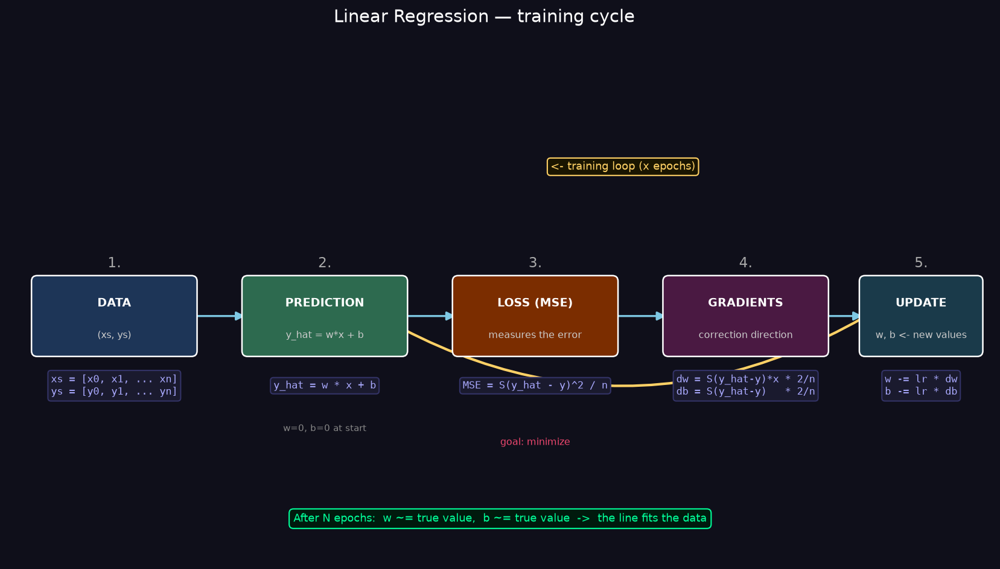
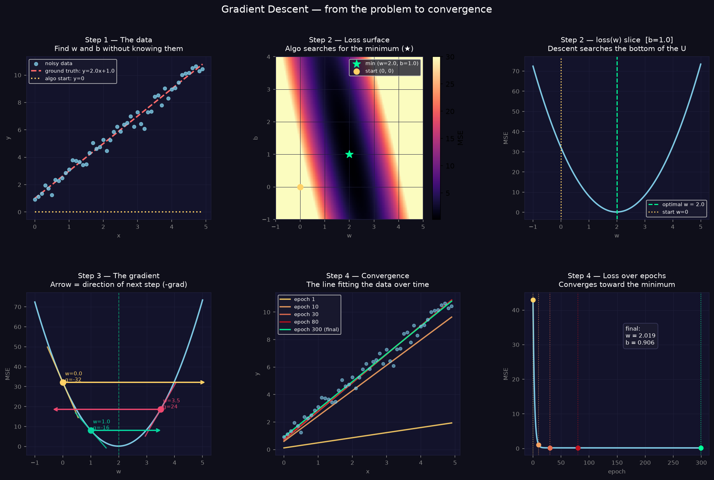
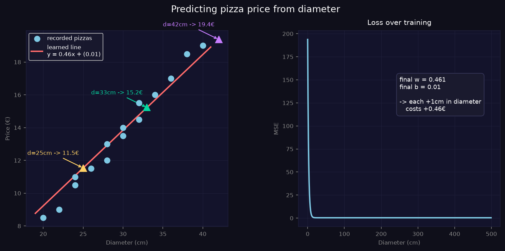

# linear-regression-from-scratch

Implementing linear regression and gradient descent from scratch in pure Python - no ML libraries, no NumPy.

Diagramme of the algorithm:

Visualization:

Example:

